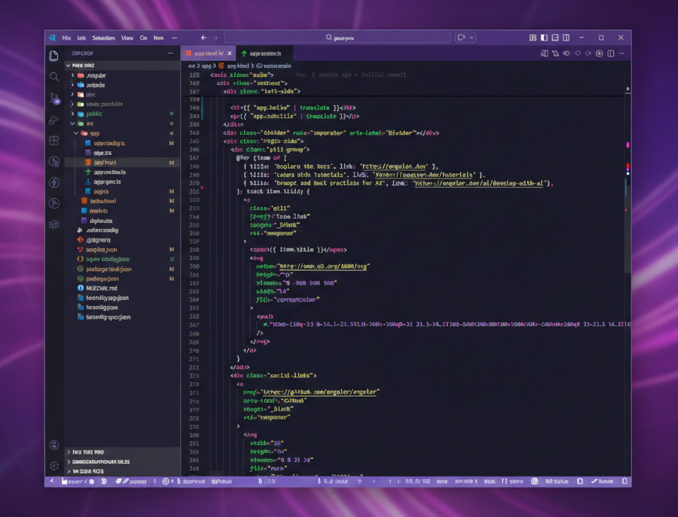

# Midnight Purple — Dark Theme 🌌💜

A deep and elegant purple dark theme for Visual Studio Code, designed for long coding sessions with reduced eye strain.

## Features
- Rich purple and violet tones
- High contrast without being harsh
- Carefully styled syntax highlighting
- Ideal for night coding
- Inspired by the Dracula theme, with a deep midnight purple twist

## Preview

## Installation
1. Open VS Code
2. Go to Extensions
3. Search for **Midnight Purple Dark Theme** or **bxstars-code**
4. Install and enjoy 💜

## Activation
- Open Command Palette (`Ctrl + Shift + P`)
- Select **Preferences: Color Theme**
- Choose **Midnight Purple Dark Theme**

## Publisher
- **bxstars** - [Linkedin](https://www.linkedin.com/in/barbaraxavier-dev)